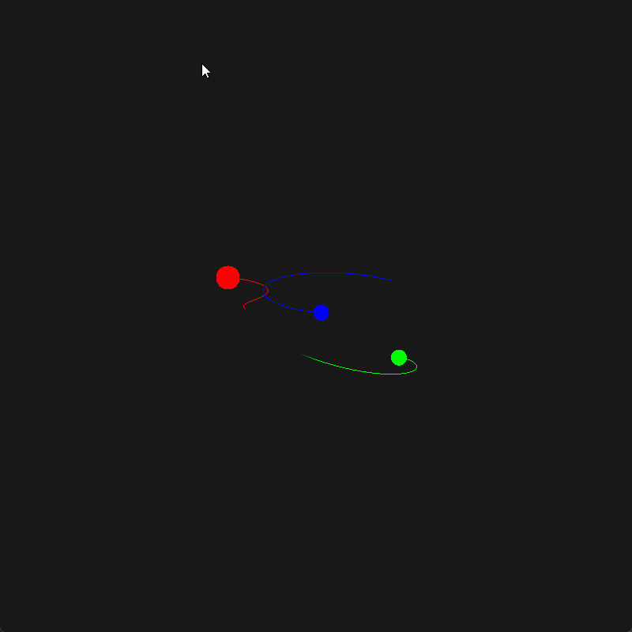

# Gravity Simulator

A simple gravity simulator written in C++ using OpenGL and GLFW for graphics rendering and window management.

This simulator uses realistic data such as astronomical units (AU) for distances and solar masses for masses. It also features an energy calculator to ensure that the total energy is conserved at every moment, validating the accuracy of the simulation.

The simulation uses the [Velocity Verlet integration method](https://en.wikipedia.org/wiki/Verlet_integration#Velocity_Verlet) for updating positions and velocities, which is known for its stability and energy conservation in physics simulations.

## Demo

## Features

- Realistic planetary data
- Energy conservation check
- Easily modifiable simulation parameters
- Adjustable field of view and screen size
- Configurable simulation speed

## How to Modify the Simulation

- To **add, modify, or delete planets**, check the comments in the `Simulation.h` file.
- To **change the field of view or screen size**, edit the values in `Circle.h`.
- To **adjust the simulation speed** (make it faster or slower), modify the settings in `main.cpp`.

## How to Use

1. Install [GLFW](https://www.glfw.org/) and configure Visual Studio (or your preferred IDE) to use it as an external library. (For WINDOWS i have the .zip of GLFW i used for this project uploaded in the repository).
2. Build and run the project.

---

*(I know the code might not be the best, but it works! xd This is my first time, and it was originally made just for personal purposes.)*
